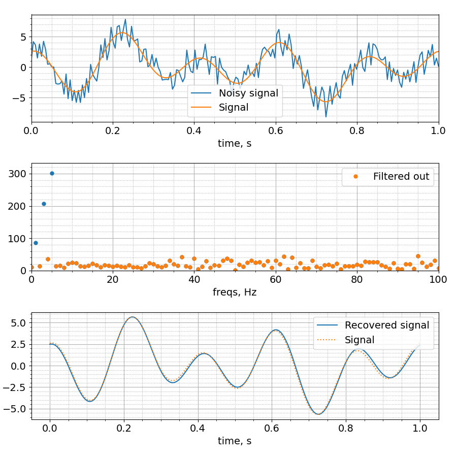
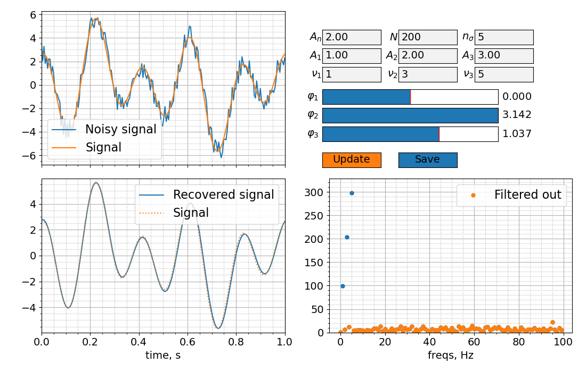
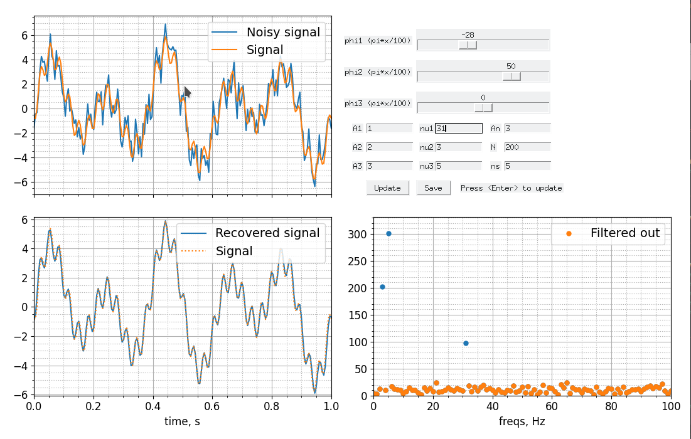
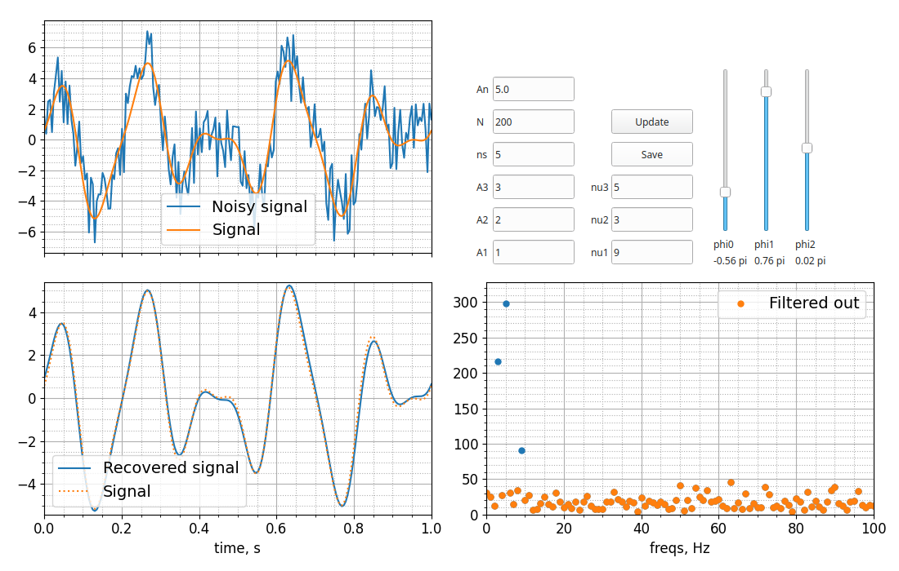

# Фурье фильтрация сигнала

В этом задании Вам предстоит реализовать генератор периодического сигнала, генератор шума и фильтр сигнала на основе преобразования Фурье.

В некотором эксперименте выполняют измерение сигнала, меняющегося со временем. Измерение происходит в течение одной секунды. За это время производится `N` измерений через равные промежутки времени. Измеряемый сигнал представляет собой сумму трех синусов, каждый со своей амплитудой, частотой и фазой:

```py
# псевдокод для основного сигнала
S0 = sum(A[i]*sin(2*pi*nu[i]*t + phi[i]) for i in range(3))
```

Будем предполагать, что частоты `nu[i]` являются натуральными числами, не кратными друг другу.

К регулярному сигналу добавляется равномерно распределенный в диапазоне от `-An/2` до `An/2` шум:

```py
# полный сигнал есть сумма регулярного сигнала и равномерного шума
S = S0 + B
```

Экспериментатор хочет пропустить набор измерений через фильтр, который подавляет шум. Для этого он выполняет [дискретное преобразование Фурье](https://en.wikipedia.org/wiki/Discrete_Fourier_transform). Продолжительность сигнала равна одной секунде, поэтому преобразование даст разложение сигнала по набору частот [0, 1, ..., N/2] Герц. В этом разложении шум будет равномерно распределен по всему спектру, в то время как сигнал будет иметь максимумы в соответствующих частотах. Для выполнения фильтрации достаточно выделить частоты, амплитуда которых достаточно велика, исключить вклады от всех остальных частот и выполнить обратное преборазование Фурье.

## Базовая версия

Решите эту задачу рамках объектно-ориенториванного подхода. Базовая версия решения требует реализации классов `FourierFilter` и `FFPlotter`. Первый отвечает за генерирование и фильтрацию сигнала, а второй - за визуализацию. Минимальная сигнатура класса `FourierFilter`:

```py
class FourierFilter:
    def __init__(self, ndots, noise_amp, signal):
        """ Аргументы конструктора:
         - ndots:int - количество измерений
         - noise_amp:float - амплитуда шума
         - signal:list - список списков с информацией о сигнале:
            signal: [
                [A1, nu1, phi1],  # амлитуда, частота и фаза
                [A2, nu2, phi2],
                [A3, nu3, phi3]
            ]
        """
        pass

    def set(self):
        """ Метод set производит все вычисления. После его вызова объект
        должен иметь следующие поля типа np.ndarray:
        - time - набор моментов времени, в которые были выполнены измерения
        - signal - набор идеальных значений сигнала (без шума)
        - noisy_signal - набор измеренных значений (включая шум)
        - transformed - преобразованный сигнал - вектор комплексных чисел
        - freqs - набор частот, соответствующих преобразованному сигналу
        - power - вектор модулей значений transformed
        - mask - булевая маска для преобразовенного сигнала. Должна иметь
            значения False для частот, которые алгоритм считает сигнальными,
            и True для остальных частот
        - recovered - восстановленный с помощью обратного преобразования
            Фурье сигнал
        """
        pass
```

Метод `FourierFilter.set` должен быть вызван в конструкторе класса `FourierFilter`. Вы можете добавлять произвольные поля и методы в классе `FourierFilter` при необходимости.

Класс `FFPlotter` строит графики на трёх осях в одном окне:

* График сравнения идеального и зашумленного сигналов (`signal` и `noisy_signal` как функции `time`)
* График, показывающий модули значений преобразованного сигнала (`power` как функция `freqs`). На этом графике каким-либо (например, цветом или формой маркера) образом должны быть отмечены значения, которые зануляются при фильтрации
* График сравнения идеального и восстановленного сигналов (`signal` и `recovered` как функции `time`)

Оси должны иметь подписи и сетку, графики должны быть описаны в легенде. Вот пример возможного расположения осей и графиков:



Минимальная сигнатура класса `FFPlotter`:

```py
class FFPlotter:
    def __init__(self, ff):
        """ ff - экземпляр класса FourierFilter """
        pass

    def plot(self):
        """ Выполняет отрисовку графиков """
        pass
```

## Указания 1

* Для выполнения преобразования Фурье можно использовать модуль `scipy.fft`:
  * Функции [fft.rfft](https://docs.scipy.org/doc/scipy/reference/generated/scipy.fft.rfft.html) и [fft.irfft](https://docs.scipy.org/doc/scipy/reference/generated/scipy.fft.irfft.html) выполняют прямое и обратное преобразования вещественного сигнала, соответственно.
  * Функция [fft.rfftfrec](https://docs.scipy.org/doc/scipy/reference/generated/scipy.fft.rfftfreq.html) возвращает набор частот, соответствующих преобразованному сигналу.
* Выполнять фильтрацию частот можно различными способами. Один из возможнных алгоритмов состоит в слеующем:
  * Для набора модулей значений `|yi|` преобразованного сигнала вычисляем медианное значение `m` и среднеквадратичное отклонение `std`
  * Исключаем из набора те значения, для которых модуль разности между модуем и медианой превосходит `n` среднеквадратичных отклонений: `||yi| - m| > n * std`
  * Повторяем процедуру для оставшихся значений. Выполняем итерации до тех пор, пока появляются новые отбрасываемые значения.

## Как тестировать решение

Решение должно находиться в файле `ffilter.py`. Работа класса `FourierFilter` может быть протестирована стандартным способом. Устанавливаем необходимые пакеты:

```sh
pip install -r requirements.txt
```

Запускаем тесты:

```sh
pytest -vs
```

Реализация класса `FFPlotter` проверяется преподавателем.

## Продвинутая версия

В этой задаче достаточно много параметров: девять параметров сигнала, частота дискретизации, уровень шума, уровень фильтрации шума. Было бы удобно иметь графический интерфейс, позволяющий изменять значения параметров и сразу видеть результат. В продвинутой версии этой задачи мы расширим сигнатуру класса `FFPlotter` и создадим класс `FFGui`, через который будет реализован графический интерфейс пользователя (GUI).

Реализовать GUI можно различными средствами. Например:

* [Виджеты matplotlib](https://matplotlib.org/3.1.1/api/widgets_api.html). Этот вариант наиболее простой в реализации, но, к сожалению, создание даже небольшого количества виджетов приводит к сильному замедлению работы программы
* Библиотека [tkinter](https://docs.python.org/3/library/tkinter.html). Для этого варианта объект `matplotlib.Figure` необходимо будет [встроить в окно Tk](https://matplotlib.org/3.1.0/gallery/user_interfaces/embedding_in_tk_sgskip.html)
* Библиотека [PyQt5](https://pypi.org/project/PyQt5/). Эту библиотеку необходимо установить отдельно. В этом варианте также необходимо будет [встроить объект `matplotlib.Figure` в окно Qt5](https://matplotlib.org/examples/user_interfaces/embedding_in_qt5.html). Больше примеров можно найти [здесь](https://www.learnpyqt.com/courses/graphics-plotting/plotting-matplotlib/).

Приведем примеры GUI. С виджетами matplotlib:



С библиотекой tkinter:



С библиотекой PyQt5:



Нет необходимости копировать эти примеры. Вы можете самостоятельно разработать интерфейс.

При интерактивной работе необходимо много раз обновлять графики и изменять диапазоны значений осей. С диапазонами значений проблем не должно возникнуть. А вот обновление графиков требует внимания. Просто создавать новые графики не получится, поскольку они будут отображаться поверх предыдущих. Можно предварительно удалять предыдущие графики. Это решит проблему, но решение это не является оптимальным. Объекты `Line2D` (которые создаются функцией `pyplot.plot`) имеют методы `set_xdata` и `set_ydata`, позволяющие задать новые данные. После обновления всех графиков нужно выполнить отрисовку, например, так:

```py
figure.canvas.draw_idle()
```

Класс `FFPlotter` должен иметь специальный метод `update_plots`, который обновляет все графики.

## Указания для работы с виджетами matplotlib

В этой задаче могут оказаться полезными виджеты `TextBox`, `Button`, `Slider`. Конструктор любого виджета matplotlib первым параметром принимает объект [`Axes`](https://matplotlib.org/api/axes_api.html#matplotlib.axes.Axes), который определяет размер и положение виджета.

Чтобы связать виджет с логикой программы необходимо связать с ним функции, которые должны вызываться при определенных событиях. Например:

* Методы `on_text_change` и `on_submit` виджета Виджет `TextBox` принимают callable объект для вызова при изменеии текста и при нажатии клавиши `Enter`, соответственно
* Метод `on_clicked` виджета `Button`
* Метод `on_changed` виджета `Slider`

Ссылка на объект виджета должна быть доступна в течение времени исполнения программы, чтобы виджет был активен.

Подробное описание и примеры смотрите [в документации](https://matplotlib.org/3.1.1/api/widgets_api.html).

## Указания для работы с tkinter

Минимальный пример встраивания графика `matplotlib` в программу с `tkinter` находится в файле `tkinter_example.py`. Рассмотрите использование виджетов `tkinter.Label`, `tkinter.Entry`, `tkinter.Button` и `tkinter.Scale`. Виджеты `tkinter.Scale` и `tkinter.Button` можно связать с callback-функциями через параметр конструктора `command`:

```py
s = tkinter.Scale(master=master, command=callable)
b = tkinter.Button(master=master, text=text, command=callable)
```

Задать и прочитать содержимое виджета `tkinter.Entry` можно с помощью методов `insert` и `get`, соответственно.

Метод `bind` позволяет связать виджет, событие и действие (callback-функцию). Так, например, можно связать главное окно программы, некоторое действие и нажатие клавиши `Enter`:

```py
class Gui(tkinter.Tk):
    def __init__(self):
        super().__init__()
        self.bind('<Return>', callable)
```

## Указания для работы с PyQt5

Минимальный пример встраивания графика `matplotlib` в программу с `PyQt5` находится в файле `pyqt_example.py`. Рассмотрите использование виджетов `QPushButton`, `QSlider`, `QLabel`, `QLineEdit` из модуля `PyQt5.QtWidgets`.

Связать эти виджеты с callback-функциями можно следующим образом:

```py
button = QPushButton(label, parent)
button.clicked.connect(callable)

qle = QLineEdit(init, parent)
qle.textChanged.connect(callable)
qle.returnPressed.connect(callable)

sld = QSlider(Qt.Vertical, parent)
sld.valueChanged.connect(callable)
```

Класс `FFPlotter` удобно сделать наследником класса `FigureCanvasQTAgg` из модуля `matplotlib.backends.backend_qt5agg`, как показано в примере. Класс `FFGui` удобно сделать наследником класса `QMainWindow` из модуля `PyQt5.QtWidgets`.

В примере GUI выше реализовано сохранения окна в графический файл. С библиотекой `PyQt5` снимок окна программы можно выполнить с помощью объекта `QPixmap` из модуля `PyQt5.QtGui`. Вот так может выглядеть метод класса `FFGui` для сохранения снимка окна:

```py
class FFGui(QMainWindow):
    # ...
    def save(self):
        pix = QPixmap(self.size())
        self.render(pix)
        pix.save('ffilter.png', 'png')
```
